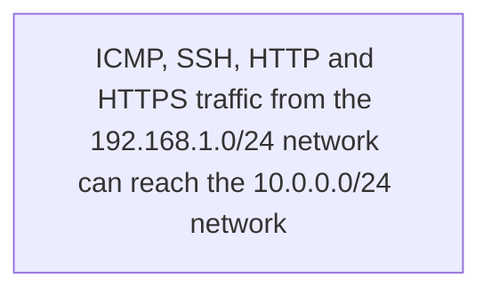
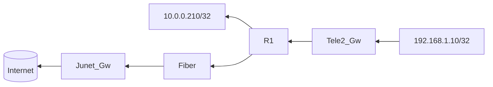
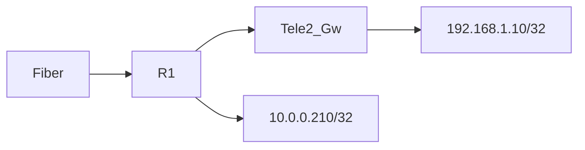
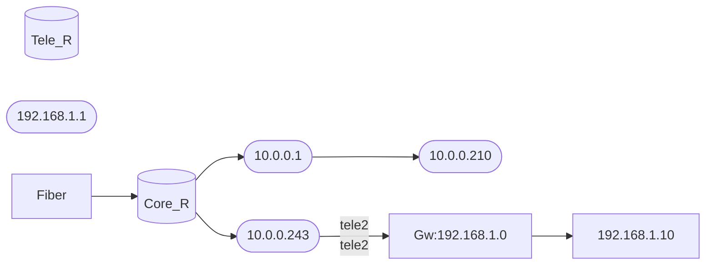

### Traffic from 192.168.1.0/24 to 10.0.0.0/24 & Internet

```mermaid
flowchart LR;
    id1[ICMP, SSH, HTTP and HTTPS traffic from the 192.168.1.0/24 network can reach the 10.0.0.0/24 network]
```
```**ICMP, SSH, HTTP and HTTPS traffic from the 192.168.1.0/24 network can reach the 10.0.0.0/24 network**```

```mermaid
graph RL;
    192.168.1.10/32-->Tele2_Gw;
    Tele2_Gw-->R1;
    R1-->10.0.0.210/32;
    R1-->Fiber;
    Fiber-->Junet_Gw;
    id2[(Internet)]
    Junet_Gw-->id2
```



```mermaid
graph LR;
    Fiber-->R1;
    R1-->Tele2_Gw;
    R1-->10.0.0.210/32;
    Tele2_Gw-->192.168.1.10/32;
```


```mermaid
graph LR;
    core[(Core_R)]
    tele2[(Tele_R)]
    gw_core([10.0.0.1])
    gw_tele2([192.168.1.1])
    ubuntu([10.0.0.210])
    link([10.0.0.243])
    Fiber-->core;
    core-->gw_core-->ubuntu
    core-->link--tele2
    tele2-->Gw:192.168.1.0-->192.168.1.10
```