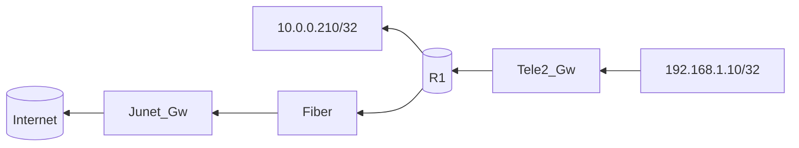

### Traffic from 192.168.1.0/24 to 10.0.0.0/24 & Internet

```ICMP, SSH, HTTP and HTTPS traffic from the 192.168.1.0/24 network can reach the 10.0.0.0/24 network```



```mermaid
graph LR;
    core[(Core_R)]
    tele2[(Tele_R)]
    core_link{{10.0.0.242}}
    tele2_link{{10.0.0.243}}
    core_gw[\10.0.0.1/]
    tele2_gw[/192.168.1.1\]

    
    Fiber-->core
    core-->core_gw
    core-->core_link
    core_link-->tele2_link
    tele2_link-->tele2
    tele2-->tele2_gw--192.168.1.10


```

