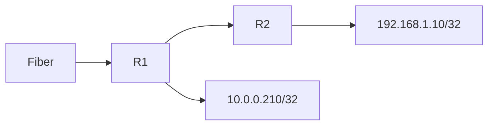
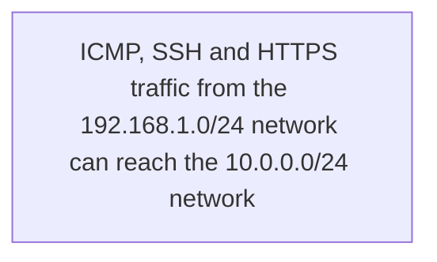
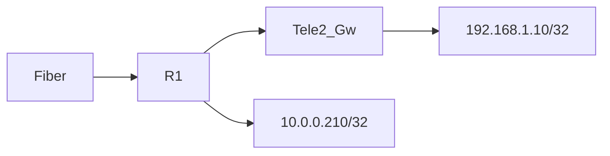
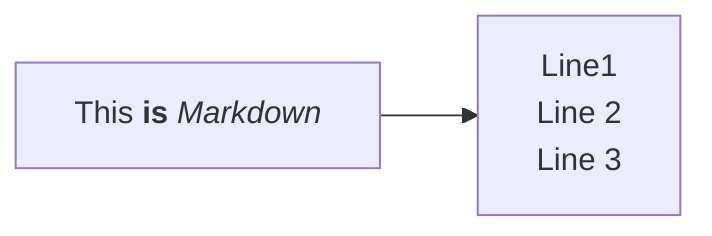

### Traffic from 192.168.1.0/24 to 10.0.0.0/24

```mermaid
graph LR;
    Fiber-->R1;
    R1-->R2;
    R1-->10.0.0.210/32;
    R2-->192.168.1.10/32;
```

```mermaid
flowchart LR;
    id1[ICMP, SSH and HTTPS traffic from the 192.168.1.0/24 network can reach the 10.0.0.0/24 network]
```

```mermaid
graph LR;
    Fiber-->R1;
    R1-->Tele2_Gw;
    R1-->10.0.0.210/32;
    Tele2_Gw-->192.168.1.10/32;
```

```mermaid
flowchart LR;
    markdown["`This **is** _Markdown_`"]
    newLines["`Line1
    Line 2
    Line 3`"]
    markdown --> newLines
```
