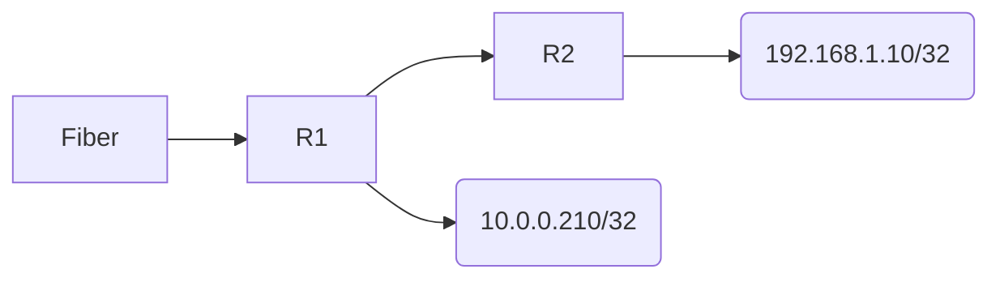

### Traffic from 192.168.1.0/24 to 10.0.0.0/24



```mermaid
Flowchart LR;
    Traffic from the 192.168.1.0/24 network can reach the 10.0.0.0/24 network
    ICMP traffic from the 192.168.1.0/24 network can reach the 10.0.0.0/24 network
    HTTPS traffic from the 192.168.1.0/24 network can reach the 10.0.0.0/24 netwrok
    SSH traffic from the 192.168.0.0/24 network can reach the 10.0.0.0/24 network
    ICMP
```


```mermaid
graph LR;
    Fiber-->R1;
    R1-->R2
    R1-->"Server(10.0.0.210/32)"
    R2-->pi(192.168.1.10/32)
```