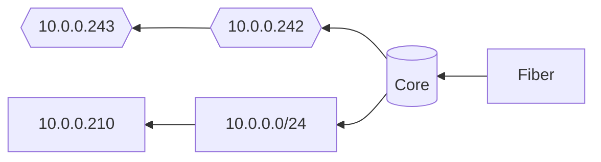

```mermaid
graph RL;
    core[(Core)]
    Fiber-->core;
    core_link{{10.0.0.242}}
    core-->core_link
    core-->10.0.0.0/24-->10.0.0.210
    tele2_link{{10.0.0.243}}
    core_link-->tele2_link
```